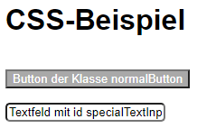

Du hast bestimmt bemerkt, dass das Beispiel vom Aussehen her anders aussieht als deine jetzige Webseite. Der Grund dafür ist die Implementierung von CSS.

### Basics

Hier als Beispiel eine einfache HTML-Seite:

```html
<!DOCTYPE html>
<html>
<body>
	<h1>CSS-Beispiel<h1>
    <button class="normalButton">Button der Klasse normalButton</button>
    <br>
    <input id="specialTextInput" type="text" value="Textfeld mit id specialTextInput">
</body>
</html>
```

Diese beinhaltet einen H1-Tag, einen Button der Klasse normalButton und ein Textfeld mit der ID specialTextInput.

In CSS arbeitet man mit Selektoren der einfachste ist der Tag-Selktor, sprich man selktiert ein einfacher Tag sei es ein ```p``` Element. 

Hier in diesem Beispiel werden alle h1-Elemente selektiert:

```css
h1 {
    font-family: Arial, Helvetica, sans-serif;
}

```

Man kann aber auch Elemente selektieren, welche zu einer bestimmten Klasse gehören. Dafür muss man den kleinen Punkt am Anfang setzen.

Hier ein Beispiel mit der normalButton Klasse:
```css
.normalButton {
    color: white;
}
```

In CSS kannst Du aber auch Elemente Selektieren die eine bestimmte ID haben. Dafür verwenden man dieses Symbol ```#``` am Anfang.

Hier ein Beispiel mit der ID specialTextInput:
```css
#specialTextInput {
    border-radius: 5px;
}
```

Jetzt kannst Du Mal selber ausprobieren Deine Seite mithilfe von CSS zu verschönern. Jedoch wenn du dann deine Seite neuladen wirst, wirst Du keine Änderungen feststellen. Es liegt daran, dass Du deine CSS-Datei mit deiner HTML-Datei noch nicht verknüpft hast.

Um dies zu erreichen muss Du in deinem Head-Element folgende Zeile hinzufügen:
```html
<head>
    <link rel="stylesheet" href="css/style.css">
</head>
```

> **Wichtig:** Pass auf, dass Du den richtigen Pfad beim ```href``` Attribut gesetzt hast.

Nun wenn alles geklappt hat, müsstest Du jetzt Änderungen sehen, wie auf der Beispiel Seite:



> Nützliche Links <br>
> [CSS Allgemein](https://www.w3schools.com/html/html_css.asp) <br>
> [CSS Attribute](https://www.w3schools.com/cssref/) <br>
### Bootstrap
Boostrap ist eine Bibilothek von vielen Klassen, welche Dir dein Leben vereinfachen.

Wenn Du mehr darüber erfahren willst hier nützliche Links:

> [Start](https://www.w3schools.com/html/html_css.asp) <br>
> [Button-Komponent](https://getbootstrap.com/docs/5.1/components/buttons/) 
