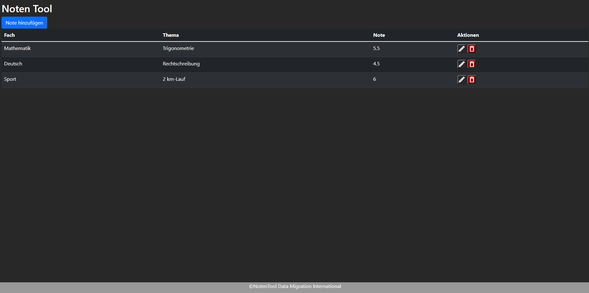

# Tag 1 
Am ersten Tag wirst Du eine Webapplikation entwickeln. Dies wirst Du mit den standard Sprachen HTML, CSS und JavaScript programmieren. Als Beispielprojekt wurde ein NotenTool verwendet bei dem man seine Noten für jedes Fach erfassen kann. Natürlich musst Du nicht unbedingt ein Notenerfassungstool entwickeln. Du kannst auch ein Autoerfassungstool entwickeln oder was auch immer, es ist egal.

Am Ende müsste das Resultat in dieser Richtung gehen:

## HTML-Elemente
[HTML-Elemente](HTML-Elemente.md ':include');

## Stylen mit CSS
[Style-Mit-CSS](Stylen-Mit-CSS.md ':include');

## JavaScript Implementierung
[JavaScriptImpelmentierung](JavascriptImplementierung.md ':include');